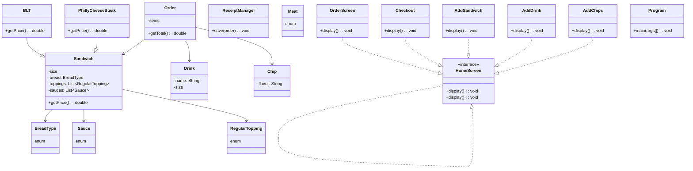

# between-the-buns
# 🥪 Between The Buns Sandwich Shop

## 📌 Project Description

The **Between The Buns Sandwich Shop** is a Java console application that simulates a customizable sandwich shop point-of-sale system, known as Between the Buns. It allows customers to fully personalize their orders with sandwich size, bread, toppings, and more. Additional items like drinks and chips can also be added. The application calculates totals and saves receipts in a structured txt format.

The application supports:
- Starting an order
- Adding a sandwich
- Adding a drink and adding chips
- Checking out

---
## 📂 Project Structure
- model/: Core domain classes like Sandwich, Order, Drink, Chip, and enums
- ui/:  Interactive screens for user navigation and input
- data/: File output utilities for receipt saving
- Program.java: Main entry point
---

## 🚀 How to Run
1. Clone the repository and open it in IntelliJ IDEA
2. Ensure Java 17+ is installed
3. Set **Program** as the main class
4. Run the application
---
## Ouput
Confirmed orders are saved to **receipts.txt** inside of the **receipts** directory, allowing for easy logging and reference. 

---
## UML Class Diagram




---

## 💡 Interesting Code Highlight

One of the most interesting parts of the project is the method that **calculates the price** of a sandwich based on its size and selected extras:
This method is used in the **Sandwich** class and called during checkout to compute the full order total.

```java
public double calculatePrice() {
    double price = 0.0;

    if (size.equals("4")) {
        price += 5.50;
        for (int i = 0; i < meats.size(); i++) {
            price += 1.00;
            if (extraMeat.get(i)) price += 0.50;
        }
        for (int i = 0; i < cheeses.size(); i++) {
            price += 0.75;
            if (extraCheese.get(i)) price += 0.30;
        }
    } else if (size.equals("8")) {
        price += 7.00;
        for (int i = 0; i < meats.size(); i++) {
            price += 2.00;
            if (extraMeat.get(i)) price += 1.00;
        }
        for (int i = 0; i < cheeses.size(); i++) {
            price += 1.50;
            if (extraCheese.get(i)) price += 0.60;
        }
    } else if (size.equals("12")) {
        price += 8.50;
        for (int i = 0; i < meats.size(); i++) {
            price += 3.00;
            if (extraMeat.get(i)) price += 1.50;
        }
        for (int i = 0; i < cheeses.size(); i++) {
            price += 2.25;
            if (extraCheese.get(i)) price += 0.90;
        }
    }

    return price;
}
